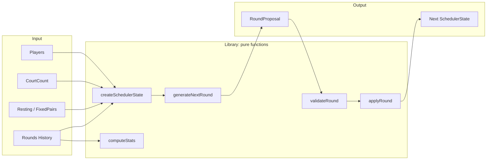
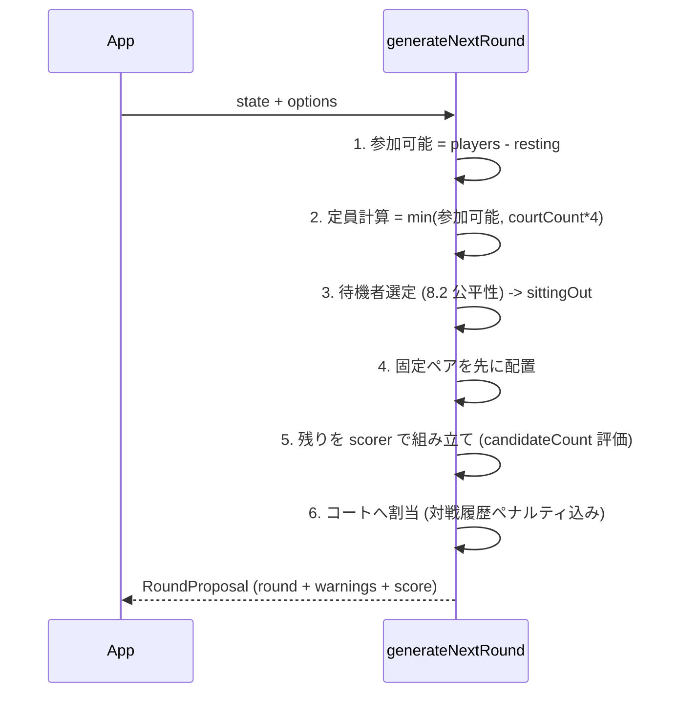
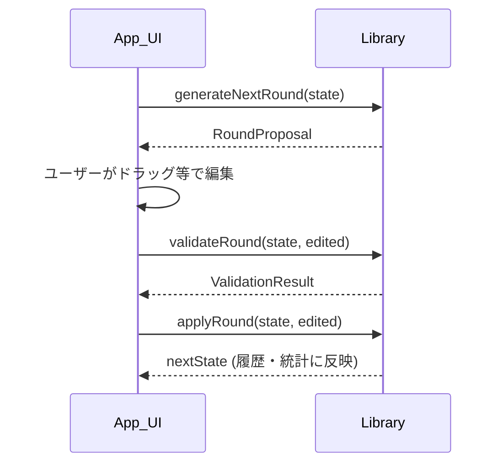

# Doubles Scheduler 仕様書 (統合版 / v1)

> SPEC1（pure function + JSON-friendly state 設計）をベースに、SPEC2 の
> `resting` / `sittingOut` 概念分離と図表ドキュメント表現を統合した版。

## 1. 概要

### 1.1 目的

ラケットスポーツ（バドミントン、テニス、卓球、ピックルボール、スカッシュ等）の
ソーシャルダブルス向けに、**次の1ラウンド分のコート割り当て**を自動生成する
TypeScript ライブラリ（npm パッケージ `doubles-scheduler`）を提供する。

ライブラリは UI やデータ保存を担当しない。アプリ側が保持する状態を受け取り、
次の組み合わせ候補を生成・検証し、適用後の新しい状態を返すことに集中する。

### 1.2 入出力

| 項目 | 内容 |
| --- | --- |
| 入力 | 全プレイヤー、コート数、履歴（`rounds`）、制約（休憩・固定ペア） |
| 出力 | 各コートの `teamA (2人) vs teamB (2人)`、明示休憩者、自動待機者 |

### 1.3 設計方針

- **生成単位**: 「次の1ラウンド」を作る単位にする（試合終了のたびに次を生成）。
- **出力範囲**: コート単位の完全な試合（4人 = 2チーム × 2人）。
- **優先方針**: 公平性優先（試合数・ペア/対戦の被りを均等化）。
- **実装の中心**: pure function。使いやすさのための class wrapper は optional で提供。
- **状態**: JSON シリアライズしやすい plain object を基本にする（`Map`/`Set`/`Date`/class instance を直接持たない）。
- **唯一の真実 (single source of truth)**: 確定済み `rounds`。統計は履歴から都度計算する。
- **プレイヤー識別**: 正式な識別子は `id`（`string | number`）。`name` は任意の表示情報。
- **制約**: 必ず守る hard constraint と、なるべく満たす soft constraint に分ける。
- **拡張性**: built-in strategy と custom scorer で生成戦略を拡張できる。

---

## 2. スコープ（責務分担）

### 2.1 ライブラリの責務

- 組み合わせの生成・再生成
- 履歴からの統計計算
- 制約違反の検出（検証）
- 戦略の選択・スコアリング
- ラウンド適用による履歴更新

### 2.2 アプリ側の責務

- プレイヤー名の表示・UI
- 生成結果の手動編集 UI と確定操作
- 試合結果の入力フォーム
- **状態の永続化**（localStorage / DB / API / file / cloud）

### 2.3 永続化の流れ

ライブラリ側:

```ts
const state = createSchedulerState(input);
const proposal = generateNextRound(state, options);
const validation = validateRound(state, proposal.round);
const nextState = applyRound(state, proposal.round);
```

アプリ側:

```ts
localStorage.setItem("scheduler", JSON.stringify(nextState));
// or DB / API / file / cloud storage
```

state は `JSON.stringify` / `JSON.parse` でそのまま扱える形を優先する。

---

## 3. 用語定義

| 用語 | 定義 |
| --- | --- |
| Player | 参加者。 |
| Team | 2人のペア。 |
| Match | 1コートで行う1試合。2チーム、計4人。 |
| Round | 同時に行う複数の試合のまとまり。 |
| Proposal | まだ履歴に適用していない、生成された組み合わせ候補。 |
| History | 過去に適用済みの round 一覧（`state.rounds`）。 |
| **Resting player** | ユーザーが明示的に「試合不参加」と指定した状態。生成対象外。 |
| **Sitting-out player** | 定員オーバー等でライブラリが今ラウンド待機にした状態。次ラウンドで優先的にローテーション。 |
| Fixed pair | 同じ round に出る場合は必ず同じ team になる2人。 |

> **重要**: `resting`（ユーザー意図の休憩）と `sittingOut`（自動あぶれ）は別概念として
> 分離して扱う。UI 表示・公平性ロジックの両方で区別が必要なため。

---

## 4. アーキテクチャ



---

## 5. データモデル

### 5.1 基本型

```ts
export type PlayerId = string | number;

export type Player<ID extends PlayerId = PlayerId> = {
  id: ID;
  name?: string;
  rating?: number;
  stats?: PlayerSeedStats;
  metadata?: Record<string, unknown>;
};

// 途中参加者などに初期値を与えるための任意 seed 値。
// 真実は履歴であり、計算統計はこれを起点に積み上げる。
export type PlayerSeedStats = {
  games?: number;
  rests?: number;
  wins?: number;
  losses?: number;
};

export type Team<ID extends PlayerId = PlayerId> = [ID, ID];

export type Match<ID extends PlayerId = PlayerId> = {
  id: string;
  court: number; // 1-based
  teamA: Team<ID>;
  teamB: Team<ID>;
  result?: MatchResult;
};

export type MatchResult = {
  winner?: "teamA" | "teamB";
  score?: {
    teamA: number;
    teamB: number;
  };
};

export type Round<ID extends PlayerId = PlayerId> = {
  id: string;
  matches: Match<ID>[];
  restingPlayers: ID[];   // ユーザー明示の休憩者
  sittingOutPlayers: ID[]; // 定員オーバーでライブラリが待機にした者
  createdAt?: string;
};
```

### 5.2 SchedulerState

```ts
export type SchedulerState<ID extends PlayerId = PlayerId> = {
  players: Player<ID>[];
  courtCount: number;
  restingPlayerIds: ID[];
  fixedPairs: Team<ID>[];
  rounds: Round<ID>[];
};
```

#### State の注意点

- `players` は現在アクティブな参加者を表す。
- 途中離脱したプレイヤーを履歴 (`rounds`) から消してはいけない。
- `rounds` 内には過去に出場したプレイヤー ID が残る。
- アプリ側で過去参加者を表示したい場合は、別途 player archive を持ってもよい。
- v1 では state 内に `Map` / `Set` / `Date` / class instance を直接持たない（JSON-friendly を維持）。
- `restingPlayerIds` は**ユーザー明示の休憩のみ**。自動あぶれ (`sittingOut`) は state に持たず、各 round の `sittingOutPlayers` に記録する。

---

## 6. Core API（pure functions）

### 6.1 初期 state 作成

```ts
export function createSchedulerState<ID extends PlayerId>(
  input: CreateSchedulerStateInput<ID>
): SchedulerState<ID>;

export type CreateSchedulerStateInput<ID extends PlayerId> = {
  players: Player<ID>[];
  courtCount: number;
  restingPlayerIds?: ID[];
  fixedPairs?: Team<ID>[];
  rounds?: Round<ID>[];
};
```

### 6.2 次ラウンド生成

```ts
export function generateNextRound<ID extends PlayerId>(
  state: SchedulerState<ID>,
  options?: GenerateOptions<ID>
): RoundProposal<ID>;

export type RoundProposal<ID extends PlayerId = PlayerId> = {
  round: Round<ID>;
  warnings: GenerationWarning<ID>[];
  score?: number;
};
```

### 6.3 ラウンド検証

```ts
export function validateRound<ID extends PlayerId>(
  state: SchedulerState<ID>,
  round: Round<ID>
): ValidationResult<ID>;

export type ValidationResult<ID extends PlayerId = PlayerId> = {
  valid: boolean;
  errors: ValidationError<ID>[];
  warnings: ValidationWarning<ID>[];
};

export type ValidationWarning<ID extends PlayerId = PlayerId> =
  | { type: "roundRestingPlayersMismatch"; expectedPlayerIds: ID[]; actualPlayerIds: ID[] }
  | { type: "unusedCourt"; court: number }
  | { type: "softConstraintViolation"; message: string };
```

### 6.4 ラウンド適用

```ts
export function applyRound<ID extends PlayerId>(
  state: SchedulerState<ID>,
  round: Round<ID>
): SchedulerState<ID>;
```

`applyRound` は内部で `validateRound` を呼び、invalid な round に対しては
error result を返すか throw する（→ 未決事項 18 参照）。適用後は
`round` が `state.rounds` に追加され、次回生成では実績として扱われる。

### 6.5 State 更新

```ts
export function addPlayer<ID extends PlayerId>(
  state: SchedulerState<ID>, player: Player<ID>
): SchedulerState<ID>;

export function removePlayer<ID extends PlayerId>(
  state: SchedulerState<ID>, playerId: ID
): SchedulerState<ID>;

export function setCourtCount<ID extends PlayerId>(
  state: SchedulerState<ID>, courtCount: number
): SchedulerState<ID>;

export function setPlayerResting<ID extends PlayerId>(
  state: SchedulerState<ID>, playerId: ID, resting: boolean
): SchedulerState<ID>;

export function setFixedPairs<ID extends PlayerId>(
  state: SchedulerState<ID>, fixedPairs: Team<ID>[]
): SchedulerState<ID>;
```

### 6.6 Optional Wrapper API

pure function を基本としつつ、必要なら class wrapper を提供する。内部状態は
常に export/import できるようにする（JSON-friendly を維持）。

```ts
const scheduler = createScheduler({ players, courtCount: 2 });

const proposal = scheduler.generateNextRound({ strategy: "avoidRepeatedPair" });
scheduler.applyRound(proposal.round);
scheduler.addPlayer({ id: "new-player" });
scheduler.setCourtCount(3);
scheduler.setPlayerResting("u1", true);

const state = scheduler.getState();        // export
const restored = createScheduler(state);   // import
```

---

## 7. GenerateOptions

```ts
export type GenerateOptions<ID extends PlayerId = PlayerId> = {
  strategy?: BuiltInStrategy; // デフォルト: "balanced"
  fixedPairs?: Team<ID>[];
  restingPlayerIds?: ID[];
  seed?: string | number;
  weights?: StrategyWeights;
  scorer?: RoundScorer<ID>;
  candidateCount?: number;
};

export type BuiltInStrategy =
  | "random"
  | "leastPlayed"
  | "avoidRepeatedPair"
  | "avoidRepeatedOpponent"
  | "balanced"
  | "custom";
```

### options の扱い

- `state.fixedPairs` と `options.fixedPairs` が両方ある場合、v1 では `options.fixedPairs` を優先する。
- `state.restingPlayerIds` と `options.restingPlayerIds` が両方ある場合、v1 では union として扱う。
- `seed` が指定された場合、同じ state と options から同じ proposal を生成できることを目標にする。
- `candidateCount` は複数候補を作って score する戦略で使う。

---

## 8. ビジネスルール

### 8.1 定員・休憩・待機

- 1 court = 4人。
- 最大プレイ人数 = `courtCount × 4`。
- 参加可能プレイヤー = `players` − `restingPlayerIds`。
- 参加可能人数が定員を超える場合、超過分を `sittingOutPlayers` に入れる。

| 概念 | 設定者 | 意味 | 格納先 |
| --- | --- | --- | --- |
| `resting` | ユーザー明示 | 試合に入らない（生成対象外） | `state.restingPlayerIds` / `round.restingPlayers` |
| `sittingOut` | ライブラリ自動 | 定員に入らなかった（公平性でローテーション） | `round.sittingOutPlayers` |

### 8.2 待機者（sittingOut）選定の公平性

定員に入るプレイヤーを選ぶ際、以下の優先度で**プレイさせる人**を選ぶ
（あぶれる人＝ sittingOut）。

1. `games`（出場回数）昇順 … 試合数が少ない人を優先してプレイ
2. `rests`（待機回数）降順 … 待機が多い人を優先してプレイ
3. 同点時: `PlayerId` を文字列化した昇順（タイブレーク、再現性確保）

### 8.3 コート数変更

- 次回生成から新しい court count を使う。
- すでに履歴に入っている round は変更しない。
- `courtCount <= 0` は invalid。
- 参加可能人数が `courtCount × 4` 未満の場合、作れる最大 match 数だけ作る。

### 8.4 途中参加・途中離脱

**途中参加 (`addPlayer`)**

- 追加後の next round から出場対象になる。
- 履歴がないため `games` は 0 として扱う。初期 seed stats を渡した場合は strategy が参照してよい。

**途中離脱 (`removePlayer`)**

- `players` から除外する。今後の生成対象から外れる。
- 過去 `rounds` からは削除しない（実績を保持）。
- `fixedPairs` / `restingPlayerIds` に残っている場合は state 更新時に除去するか、validation warning を返す。

---

## 9. 制約

### 9.1 Hard Constraints（生成・検証で必ず守る）

- 1 match は必ず4人で構成する。
- 1 team は必ず2人で構成する。
- 1 round 内で同じ player は重複出場しない。
- `restingPlayerIds` に含まれる player は出場しない。
- `restingPlayers` に含まれる player は `sittingOutPlayers` に含まれない（概念が排他）。
- match 数は `courtCount` を超えない。
- court number は `1..courtCount` の範囲に収める。
- active players に存在しない player は、新規生成 round には含めない。
- fixed pair は、両者が同じ round に出る場合は同じ team になる。
- fixed pair の片方だけを出場させる組み合わせは作らない（両方プレイ or 両方待機）。
- 同一 player を含む fixed pair が複数あってはならない。

### 9.2 Soft Constraints（戦略でなるべく満たす）

- 試合数が少ない player を優先する。
- 連続休憩・連続待機を避ける。
- 連続出場を避ける（参加人数とコート数によっては許容）。
- 過去に pair になっていない player 同士を優先する。
- 同じ対戦相手の繰り返しを避ける。
- `rating` がある場合、team 間の rating 差が小さい match を優先する。
- `wins` / `losses` がある場合、強さが偏りすぎない match を優先する。
- 完全固定になりすぎないよう、必要に応じて randomness を入れる。

### 9.3 Fixed Pair の仕様

- fixed pair は「出場する場合は必ず同じ team になる」という意味であり、必ず出場させる意味ではない。
- fixed pair の片方が休憩中の場合、その pair は出場不可。
- fixed pair の片方だけを出場させる proposal は invalid。
- 同一 player を含む fixed pair が複数ある場合は invalid。

```ts
fixedPairs: [["a", "b"]]

// valid:   teamA: ["a", "b"]
// invalid: teamA: ["a", "c"], teamB: ["b", "d"]
```

---

## 10. 生成アルゴリズム



人数規模は 8〜24人、2〜6コートを主に想定。ヒューリスティック + 貪欲法で対応する。
strategy は hard constraints を満たす candidate の中から選ぶ。

---

## 11. Built-in Strategies

| 戦略 ID | 説明 | スコア基準 |
| --- | --- | --- |
| `random` | 制約を満たす範囲でランダム（seed で再現可能） | ランダム値 |
| `leastPlayed` | 出場回数が少ない player を優先 | `games` 平準化・休憩偏り軽減 |
| `avoidRepeatedPair` | 過去 pair 回数が少ない組み合わせを優先 | partner ペナルティ |
| `avoidRepeatedOpponent` | 過去対戦回数が少ない組み合わせを優先 | opponent ペナルティ |
| `balanced`（デフォルト） | 複数 soft constraint の複合スコア最大化 | 複合ペナルティ |
| `custom` | アプリ側が `scorer` を渡す | 任意 |

### 11.1 balanced の weight と複合スコア

```ts
export type StrategyWeights = {
  balanceGames?: number;
  avoidRepeatedPair?: number;
  avoidRepeatedOpponent?: number;
  avoidConsecutiveRest?: number;
  avoidConsecutivePlay?: number;
  balanceRating?: number;
  randomness?: number;
};

const defaultBalancedWeights: Required<StrategyWeights> = {
  balanceGames: 8,
  avoidRepeatedPair: 10,
  avoidRepeatedOpponent: 4,
  avoidConsecutiveRest: 6,
  avoidConsecutivePlay: 2,
  balanceRating: 5,
  randomness: 1,
};
```

スコアは「小さいほど良いペナルティ」の重み付き合計として算出する
（例: `partnerPenalty × w + opponentPenalty × w + fairnessPenalty × w ...`）。
`fairnessPenalty` は今ラウンド出場者の `games` の max − min。

### 11.2 custom

```ts
export type RoundScorer<ID extends PlayerId = PlayerId> = (
  candidate: Round<ID>,
  context: ScoringContext<ID>
) => number;

export type ScoringContext<ID extends PlayerId = PlayerId> = {
  state: SchedulerState<ID>;
  playerStats: ComputedPlayerStats<ID>[];
  pairStats: ComputedPairStats<ID>[];
  opponentStats: ComputedOpponentStats<ID>[];
};
```

`custom` 指定時に `scorer` がない場合は validation error または runtime error にする。

---

## 12. Computed Stats（履歴から計算）

履歴 (`rounds`) が唯一の真実であり、統計は保存済み state に重複保持せず必要時に計算する。
これにより手動編集や取りこぼしによる**履歴と統計の不整合を構造的に防ぐ**。

```ts
export type ComputedPlayerStats<ID extends PlayerId = PlayerId> = {
  playerId: ID;
  games: number;
  rests: number;       // 明示休憩した回数
  sitOuts: number;     // 自動待機した回数
  wins: number;
  losses: number;
  lastRoundPlayed?: string;
  lastRoundRested?: string;
};

export type ComputedPairStats<ID extends PlayerId = PlayerId> = {
  pair: Team<ID>;
  gamesTogether: number;
};

export type ComputedOpponentStats<ID extends PlayerId = PlayerId> = {
  players: Team<ID>;
  gamesAgainst: number;
};

export function computePlayerStats<ID extends PlayerId>(
  state: SchedulerState<ID>
): ComputedPlayerStats<ID>[];

export function computePairStats<ID extends PlayerId>(
  state: SchedulerState<ID>
): ComputedPairStats<ID>[];
```

### 12.1 履歴キーの正規化

順序に依存しない canonical key を使う。

```
pairKey  = sort([idA, idB]).join(":")
teamKey  = sort([p1, p2]).join(":")
matchKey = sort([teamKeyA, teamKeyB]).join("|")
```

---

## 13. 手動編集フロー



```ts
const proposal = generateNextRound(state);
const editedRound = { ...proposal.round, matches: manuallyEditedMatches };
const validation = validateRound(state, editedRound);
if (validation.valid) {
  state = applyRound(state, editedRound);
}
```

- 手動編集 UI はアプリ側が実装する。ライブラリは検証と適用を担当する。
- 編集後も `applyRound` で履歴へ反映され、次回生成では実績として扱われる。
- Phase 2 で薄い編集ヘルパー（`swapPlayers`, `movePlayer`）を検討。

---

## 14. エラー・警告設計

### 14.1 Validation Errors

```ts
export type ValidationError<ID extends PlayerId = PlayerId> =
  | { type: "duplicatePlayer"; playerId: ID }
  | { type: "unknownPlayer"; playerId: ID }
  | { type: "restingPlayerIncluded"; playerId: ID }
  | { type: "restingPlayerInSittingOut"; playerId: ID }
  | { type: "invalidTeamSize"; matchId: string }
  | { type: "invalidMatchSize"; matchId: string }
  | { type: "courtCountExceeded"; court: number }
  | { type: "invalidCourtNumber"; court: number }
  | { type: "fixedPairBroken"; pair: Team<ID> }
  | { type: "conflictingFixedPairs"; playerId: ID }
  | { type: "invalidCourtCount"; courtCount: number };
```

### 14.2 Generation Warnings

```ts
export type GenerationWarning<ID extends PlayerId = PlayerId> =
  | { type: "notEnoughPlayers"; availablePlayerCount: number }
  | { type: "unusedCourts"; unusedCourtCount: number }
  | { type: "playersSatOut"; playerIds: ID[] }
  | { type: "fixedPairUnavailable"; pair: Team<ID>; reason: string };
```

---

## 15. 生成結果の例

```ts
const state = createSchedulerState({
  players: [{ id: 1 }, { id: 2 }, { id: 3 }, { id: 4 }, { id: 5 }, { id: 6 }],
  courtCount: 1,
});

const proposal = generateNextRound(state, {
  strategy: "avoidRepeatedPair",
  seed: 123,
});

proposal.round;
// {
//   id: "round-1",
//   matches: [
//     { id: "match-1", court: 1, teamA: [1, 4], teamB: [2, 6] },
//   ],
//   restingPlayers: [],      // 明示休憩なし
//   sittingOutPlayers: [3, 5] // 定員あぶれ
// }
```

固定ペア・休憩込みの例:

```ts
let state = createSchedulerState({
  players: [1, 2, 3, 4, 5, 6, 7, 8, 9, 10].map((id) => ({ id })),
  courtCount: 2,
});

state = setFixedPairs(state, [[1, 2]]);
state = setPlayerResting(state, 10, true);

const round = generateNextRound(state, { strategy: "balanced" }).round;
// round.matches[0]: { court: 1, teamA: [1, 2], teamB: [3, 4] }
// round.restingPlayers: [10]
// round.sittingOutPlayers: 定員あぶれ分（10 は resting のため含まれない）

const validation = validateRound(state, round);
if (validation.valid) state = applyRound(state, round);

state = addPlayer(state, { id: 11 });
state = setCourtCount(state, 3);
```

---

## 16. パッケージ構成（実装時）

```
src/
  index.ts
  types.ts
  errors.ts
  state/
    create-state.ts
    apply-round.ts
    update-state.ts        // addPlayer / removePlayer / setCourtCount ...
  generator/
    generate-next-round.ts
    select-sitting-out.ts
    assign-courts.ts
  strategies/
    index.ts
    random.ts
    least-played.ts
    avoid-repeated-pair.ts
    avoid-repeated-opponent.ts
    balanced.ts
  validation/
    validate-round.ts
  stats/
    compute-stats.ts
  wrapper/
    scheduler.ts           // optional class wrapper
  utils/
    pair-key.ts
    compare-players.ts
    scoring.ts
    random.ts              // seed 対応 PRNG
tests/
  state.test.ts
  generator.test.ts
  strategies.test.ts
  validation.test.ts
  stats.test.ts
docs/
  SPEC3.md
```

---

## 17. フェーズ計画

### Phase 1 — MVP

- [ ] `createSchedulerState` / `generateNextRound` / `validateRound` / `applyRound`
- [ ] state 更新: `addPlayer` / `removePlayer` / `setCourtCount` / `setPlayerResting` / `setFixedPairs`
- [ ] built-in strategy: `random` / `leastPlayed` / `avoidRepeatedPair`
- [ ] `resting` / `sittingOut` の分離
- [ ] fixed pair 対応・途中参加/離脱対応・手動編集 round の検証
- [ ] 履歴からの統計算出 helper（`computePlayerStats` / `computePairStats`）
- [ ] seed 指定時の deterministic generation + 基本テスト

### Phase 2 — 拡張

- [ ] built-in strategy: `avoidRepeatedOpponent` / `balanced`
- [ ] `custom scorer` プラグイン
- [ ] rating / wins-losses を使った実力バランス
- [ ] 編集ヘルパー（`swapPlayers` / `movePlayer`）
- [ ] optional class wrapper（`createScheduler`）

### Phase 3 — 任意

- [ ] match result の記録 API / score 記録 / rating update
- [ ] 複数ラウンド一括生成
- [ ] round undo
- [ ] export/import helper（state は元々 JSON-friendly なため薄い helper でよい）
- [ ] Swiss-system-like matching / group constraint（男女混合・レベル別・同所属回避）
- [ ] より高度な最適化アルゴリズム

---

## 18. 確定済み設計判断と未決事項

### 18.1 確定済み

| 項目 | 決定 |
| --- | --- |
| 中心設計 | pure function + JSON-friendly plain object state |
| 統計の真実 | 履歴 (`rounds`) を single source of truth とし、統計は都度計算 |
| 休憩と待機 | `resting`（明示）と `sittingOut`（自動）を分離 |
| 退出プレイヤーの履歴 | `removePlayer` 後も `rounds` に残す |
| 同点タイブレーク | `PlayerId` を文字列化した昇順 |
| npm パッケージ名 | `doubles-scheduler` |
| 生成単位 | 次の1ラウンドずつ |
| 優先方針 | 公平性優先 |

### 18.2 未決事項（実装前または開発中に決める）

- `applyRound` は invalid round に対して throw するか、result object を返すか。
- `Round.id` / `Match.id` をライブラリが生成するか、アプリ側から渡せるようにするか。
- `createdAt` をライブラリが付与するか、アプリ側の責務にするか。
- `state.players` から remove された player の表示名を履歴表示でどう扱うか。
- `balanced` / `custom scorer` を Phase 1 に前倒しするか。

---

## 19. テスト観点

### 19.1 生成

- 4人・1コートで1試合が生成される。
- 8人・2コートで2試合が生成される。
- 6人・2コートでは1試合のみ生成され、2人が `sittingOut` になる。
- 明示休憩 player は出場せず `restingPlayers` に入り、`sittingOut` には入らない。
- `sittingOut` 選定が公平性（games 昇順 / rests 降順 / id 昇順）に従う。
- fixed pair は同じ team になる。
- 4人未満で1コートも組めない場合は warning（`notEnoughPlayers`）を返す。

### 19.2 検証

- fixed pair の片方だけが入る round は invalid。
- 1 round 内の player 重複は invalid。
- unknown player を含む手動編集 round は invalid。
- 休憩 player がコートに含まれる手動編集 round は invalid。
- 休憩 player が `sittingOut` に含まれる round は invalid。

### 19.3 戦略・統計

- `leastPlayed` は試合数が少ない player を優先する。
- `avoidRepeatedPair` は未経験 pair を優先する。
- `seed` が同じなら同じ proposal になる。
- `applyRound` 後に計算統計が更新される（履歴ベース）。
- 途中参加 player は games 0 として扱われる。
- 途中離脱 player は次回生成対象から外れるが、過去履歴には残る。

---

## 改訂履歴

| 版 | 日付 | 内容 |
| --- | --- | --- |
| 1.0 | 2026-06-25 | SPEC1 と SPEC2 を統合した初版 |
